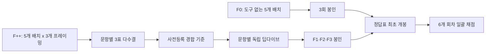

# GPT-5.6 Sol 한국 변호사시험 공법 선택형 평가

제15회 변호사시험 공법 선택형 40문항을 대상으로, `gpt-5.6-sol`과 법령·판례·교재 도구를 결합한 근거 기반 워크플로가 독립 3회에서 재현 가능한 만점을 달성하는지 사전등록·봉인·블라인드 채점으로 평가한 저장소입니다.

## 핵심 결과

| 조건 | Run 1 | Run 2 | Run 3 | 평균 |
|---|---:|---:|---:|---:|
| F0, 도구 없음 | 33/40 | 34/40 | 32/40 | 33.0/40, 82.5% |
| F++, 도구·3표·딥다이브 | 40/40 | 40/40 | 40/40 | 40.0/40, 100.0% |

- 사전등록 성공 기준인 독립 3회 모두 40/40을 충족했습니다.
- OFF 대비 평균 개선은 7문항, 17.5%포인트입니다.
- 사전등록된 회상 오염 의심 기준은 OFF 평균 38/40 이상이었고, 실제 평균은 33/40이므로 플래그가 발생하지 않았습니다.
- 1차 3표 다수결은 세 회차 모두 37/40이었습니다. 최종 만점은 문항별 딥다이브가 매회 3개의 다수결 오답을 바로잡아 달성했습니다.
- 딥다이브는 120개 Run-문항 중 113개, 94.2%에 적용됐습니다. 따라서 이 실험은 저비용 선택 검증보다 고정확도 상한 탐색에 가깝습니다.

## 평가 파이프라인



## 이 결과가 말해 주는 것

이 실험은 특정 모델·추론 강도·법률 도구 묶음·다중 프레이밍·광범위한 딥다이브를 결합한 전체 워크플로가 이 40문항에서 안정적으로 만점을 재현했다는 증거입니다. 개별 도구 하나의 독립적 인과효과, 다른 연도·과목으로의 일반화, 실제 시험 시간·비용 제약 아래의 성능을 입증하지는 않습니다.

특히 세 프레이밍의 단순 다수결만으로는 매회 3문항이 틀렸습니다. 9회의 최종 답 변경 중 8회는 세 프레이밍이 만장일치로 틀린 경우였습니다. 다수결은 비상관 오류를 줄였지만, 공유된 법리 오독을 제거하지 못했고 원문 중심의 딥다이브가 그 역할을 했습니다.

## 문서

- [상세 결과 해석](docs/DETAILED_ANALYSIS_KO.md)
- [재현성과 무결성](docs/REPRODUCIBILITY.md)
- [원 채점 보고서](experiment/04_scoring/RESULT_X.md)
- [사전등록](experiment/PREREG_X.txt)
- [실행 런북](experiment/RUNBOOK_X.md)

## 저장소 구성

```text
analysis/                결과 재계산 스크립트와 사용량 요약
docs/                    상세 해석과 재현성 문서
experiment/              원 클린룸에서 선별한 봉인본·파트·도구·채점 결과
manifests/               원시 실행 로그의 SHA-256 목록
```

원시 Codex JSONL 로그는 약 100MB 이상이고 로컬 경로·도구 응답 전문을 포함하므로 Git 본문에서 제외했습니다. 대신 모든 로그의 SHA-256을 [RAW_LOGS_SHA256.txt](manifests/RAW_LOGS_SHA256.txt)에 기록했습니다.

## 분석 재실행

Python 표준 라이브러리만 필요합니다.

```bash
python3 analysis/analyze_results.py
```

## 최종 기준점

- 사전등록 커밋: `7b6abc0c44aa5b849aa3cacd6dd08fc3fb563669`
- F1 봉인 커밋: `55cf416c8b6569fdcb82479bf417cc519eb74af4`
- F2 봉인 커밋: `459795413e6fc3551c8a23526f2ca489c0a52d06`
- F3 봉인 커밋: `1203166bc32b7dd99ecd2de55176dbec65bad936`
- 단일 블라인드 채점 커밋: `e938b25fdfab9ba1ecc41a3f6718804a405c593a`

F1은 봉인 시각보다 Git 커밋이 늦은 절차상 일탈이 있습니다. 봉인본·SEAL·스냅샷 해시는 일치했지만, 이 사실은 결과 해석에서 숨기지 않습니다.

## 이용상 주의

이 저장소는 연구·재현성 검토를 위한 자료이며 법률 자문이 아닙니다. 시험문제·정답표·법령·판례 텍스트의 권리는 각 원출처에 있습니다. 자세한 내용은 [NOTICE.md](NOTICE.md)를 참고하십시오.
